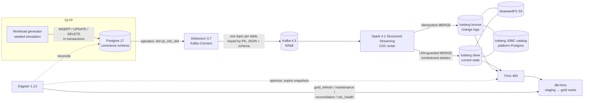

# quick-commerce-cdc-lakehouse

[](https://github.com/rohit91jacob/quick-commerce-cdc-lakehouse/actions/workflows/ci.yml)
[](LICENSE)
[](pyproject.toml)

An end-to-end **change-data-capture lakehouse** for a 10-minute grocery delivery business (Blinkit / Zepto / Instacart style).

1. A deterministic simulator runs the OLTP side: dark stores, catalogue, inventory, orders, riders, payments and refunds.
2. Debezium streams every committed change from Postgres into Kafka.
3. A Spark Structured Streaming job lands the changes in Apache Iceberg as an append-only change log (bronze) and a current-state mirror (silver).
4. dbt on Trino builds analytics marts: funnel, delivery SLA, stock-outs and lost sales, baskets, cohorts, rider utilisation, promos.
5. Dagster orchestrates dbt, table maintenance, reconciliation and health checks.

The pipeline is **provably correct**: a reconciliation job compares every table and column aggregate between Postgres and silver, and must match exactly. The CI e2e job checks this after a writer crash, after a full replay, and after table maintenance.

## Architecture



| Component | Role | Code / config |
|---|---|---|
| Postgres (OLTP) | System of record; `wal_level=logical`, publication `qc_cdc_pub` | `src/qcommerce/db/migrations` |
| Workload generator | Discrete-event simulation of stores, customers, riders; real multi-table transactions, deletes and an online schema change | `src/qcommerce/generator` |
| Debezium | Initial snapshot + streaming, heartbeats, signalling table for incremental snapshots | `src/qcommerce/cdc/connector.py` |
| Kafka | One topic per table; hot tables have 3 partitions; 7-day retention | `docker-compose.yml` |
| CDC writer | `foreachBatch`: survey → parse → bronze MERGE → silver MERGE, schema evolution, dead letters, Prometheus metrics | `src/qcommerce/lakehouse` |
| Iceberg + SeaweedFS | Table format (v2, merge-on-read silver) on S3-compatible storage | `lakehouse/tables.py`, `infra/` |
| Trino | SQL engine for dbt, maintenance and reconciliation | `infra/trino` |
| dbt | 19 staging views, 2 intermediate, 15 gold models, 51 data tests, 1 unit test | `dbt/` |
| Dagster | Assets (silver as external assets with freshness checks, dbt models), jobs, schedules, failure sensor | `src/qcommerce/orchestration` |
| Reconciliation | Exact (two-phase fence) and settled modes | `src/qcommerce/reconcile.py` |

## Tech stack (pinned)

| | Version |
|---|---|
| PostgreSQL | 17.11 |
| Debezium Postgres connector / Connect image | 3.7.0.Final |
| Apache Kafka (KRaft) | 4.3.1 |
| Apache Spark / PySpark | 4.1.3 (Scala 2.13, Java 21) |
| Apache Iceberg (Spark runtime, AWS bundle) | 1.12.0 |
| Trino | 483 (Java 25) |
| SeaweedFS | 4.48 |
| dbt-core / dbt-trino | 1.10 / 1.10 |
| Dagster / dagster-dbt | 1.13.25 / 0.29.25 |
| Python | 3.12 (app image); the writer image uses the Spark image's Python |

Python dependencies are locked in `uv.lock`.

## Data

The data is **synthetic**, from a seeded generator: no external source, no licence constraints, no PII. Names are pseudonymous and all brands are fictional. The same seed and start time always produce the same transaction stream (`tests/unit/test_generator_engine.py`).

The simulation has:
- 2–5 cities, with dark stores that each have a catchment radius and picker capacity
- about 320 SKUs in 13 categories, with Pareto popularity
- customers with order propensities and churn, which yields cohort retention
- diurnal and weekly demand curves, festival spikes (Diwali, New Year's Eve...) and evening rain that raises demand and slows riders
- inventory depletion, restocks twice a day, stock-outs and delisting/relisting of SKUs
- substitutions at checkout and at picking, and lines removed when the shelf is empty
- UPI, card, wallet and COD payments with failures, and refunds for cancellations, missing items and late deliveries
- rider shifts with assignment queues, and a 10-minute promise (15 in rain)

**Refresh cadence.** In live mode the generator writes in wall-clock time (`--rate-multiplier` scales demand) and `--backfill-hours` simulates history first. The writer triggers every 10–15 s (each micro-batch then takes seconds to minutes; see limitations), and dbt gold refreshes every 15 minutes.

## Data model

| Layer | Where | Grain / key |
|---|---|---|
| OLTP | Postgres `commerce.*` (16 business tables) | primary keys; composite for `inventory (store_id, product_id)` |
| Bronze | `lakehouse.bronze.<table>` | one row per change event, unique on (PK, `_lsn`, `_op`) |
| Silver | `lakehouse.silver.<table>` | one row per PK, current state, deletes as tombstones (`_is_deleted`) |
| Staging | `lakehouse.staging.stg_*` (views) | live silver rows; `*__changes` views over bronze |
| Gold | `lakehouse.gold.*` | dims (incl. SCD2 price and store history from the change log), facts (incremental), 8 marts |

The full column-level description is in **[docs/data_dictionary.md](docs/data_dictionary.md)**. How duplicates, ordering, deletes and schema changes are handled is in **[docs/cdc_semantics.md](docs/cdc_semantics.md)**.

## Quickstart

### Prerequisites

- **Docker Compose path:** Docker with Compose v2, and about 8 GB RAM free for the stack.
- **Development path:** Python 3.12, [uv](https://docs.astral.sh/uv/), and Java 17+ for the Spark tests.

### Run with Docker Compose

> **Verified in CI only.** The development machine had no Docker, so these commands were not run locally. The `e2e` job in [`.github/workflows/ci.yml`](.github/workflows/ci.yml) runs the same flow through [`scripts/e2e.sh`](scripts/e2e.sh) on every push.

```bash
cp .env.example .env              # then change the secrets
make up                           # docker compose up -d --build --wait
make bootstrap                    # bucket, migration V001, seed reference data, register Debezium
make demo                         # continuous workload (24 h backfill, then live)
make reconcile                    # exact Postgres vs silver comparison
make dbt-build                    # dbt build on Trino
open http://localhost:3000        # Dagster UI (schedules start automatically)
```

Useful endpoints:

| URL | What |
|---|---|
| `localhost:3000` | Dagster |
| `localhost:8080` | Trino (catalog `lakehouse`) |
| `localhost:8083` | Kafka Connect REST |
| `localhost:9405/metrics` | writer metrics (`/progress` for JSON) |

### Run bare-metal (how this repo was developed)

The services run as plain processes (Postgres from conda-forge, the Kafka/Trino/SeaweedFS tarballs, the Debezium plugin). The `qc` CLI reaches them through the `QC_*` variables. These commands were run exactly like this:

```bash
uv sync --extra app --python 3.12                       # creates the virtualenv
python -m qcommerce.cli db migrate --target 1           # V001 only; V002 is applied mid-run by the generator
python -m qcommerce.cli generator seed
python -m qcommerce.cli cdc register                    # connector RUNNING, initial snapshot
python -m qcommerce.cli writer run                      # long-running (Spark jars resolved via QC_WRITER_JARS_PACKAGES)
python -m qcommerce.cli generator run --backfill-hours 6 --live-minutes 4 --schema-change-after-minutes 1.5
python -m qcommerce.cli reconcile --mode exact --timeout 1800
```

Output of the last two commands, from that run:

```text
{"msg": "backfill finished", "orders": 851, "txns": 5748}
{"msg": "applied migration", "version": 2, "migration": "orders_tip_amount"}
{"msg": "generator finished", "orders_placed": 865, "orders_delivered": 807, "sla_met": 597, "sla_breached": 210,
 "items_removed_at_picking": 24, "substitutions_at_checkout": 174, "transactions": 5825, "operations": 24817, ...}

reconciliation (exact) PASSED in 115.0s, fence LSN 0/23BA918
table                   source rows  silver rows  result
cities                            2            2  ok
dark_stores                       6            6  ok
...
orders                          865          865  ok
order_items                   3,223        3,223  ok
order_status_history          5,028        5,028  ok
payments                        865          865  ok
refunds                          43           43  ok
```

Other commands run during development:

```bash
python -m qcommerce.cli ops checksums --schema silver                    # content fingerprints per table
python -m qcommerce.cli cdc status                                       # connector + replication slot lag
cd dbt && dbt build && dbt source freshness                              # PASS=88 WARN=0 ERROR=0
dagster job execute -m qcommerce.orchestration.definitions -j iceberg_maintenance   # also: reconciliation, cdc_health, gold_refresh
```

## Configuration

Every component reads `QC_*` environment variables (`src/qcommerce/settings.py`). Compose takes its secrets from `.env` (see [`.env.example`](.env.example)).

| Variable | Default | Purpose |
|---|---|---|
| `QC_PG_ADMIN_PASSWORD` / `QC_PG_APP_PASSWORD` / `QC_PG_DEBEZIUM_PASSWORD` | — | OLTP roles: owner (migrations), `qc_app` (generator, reconciliation), `debezium` (replication) |
| `ICEBERG_DB_PASSWORD`, `DAGSTER_DB_PASSWORD` | — | platform Postgres roles (Iceberg catalog, Dagster storage) |
| `S3_ACCESS_KEY`, `S3_SECRET_KEY` | — | SeaweedFS S3 identity used by Spark and Trino |
| `QC_GEN_SEED` | `42` | generator seed (also `QC_GEN_CITIES`, `_STORES_PER_CITY`, `_PRODUCTS`, `_CUSTOMERS`, `_RIDERS_PER_STORE`, `_BASE_ORDERS_PER_STORE_HOUR`, `_PROMISED_MINUTES`) |
| `QC_DEMO_BACKFILL_HOURS` | `24` | history simulated by `make demo` before going live |
| `QC_WRITER_TRIGGER_SECONDS` | `15` (compose: `10`) | micro-batch interval |
| `QC_WRITER_MAX_OFFSETS_PER_TRIGGER` | `100000` | batch size cap (bigger batches amortise per-table MERGE cost) |
| `QC_WRITER_MERGE_RETRIES` | `5` | retries on Iceberg commit conflicts (e.g. with compaction) |
| `QC_WRITER_CHECKPOINT_LOCATION` | `/data/checkpoints/cdc-writer` (image) | Spark checkpoint; deleting it triggers a full, idempotent replay |
| `QC_*_HOST_PORT` | 5432 / 8083 / 8080 / 9405 / 3000 | host ports published by compose |
| `QC_ALERT_WEBHOOK_URL` | unset | Dagster run-failure alerts are POSTed here |
| `QC_LOG_LEVEL`, `DBT_TARGET` | `INFO`, `dev` | logging (JSON lines) and the dbt target (`ci` in the e2e test) |

## Testing & CI

| Suite | Command | What it covers |
|---|---|---|
| Unit | `python -m pytest tests/unit` | generator invariants (replayed into an in-memory relational model: keys, stock ≥ 0, state machine, money adds up, determinism, deletes present), Connect-schema → Spark type mapping, MERGE SQL, reconciliation comparisons, metrics, CLI |
| Spark | `python -m pytest tests/spark` | the real `foreachBatch` against a local Iceberg catalog: snapshot + streaming, duplicates and full replay, stale and out-of-order events, delete-before-insert, re-insert after delete (composite key), schema evolution, mixed schema versions in one batch, TOAST placeholders, TRUNCATE, dead letters |
| Integration | `python -m pytest -m integration tests/integration` | migrations (stepwise, idempotent), seed, backfill and resume against Postgres |
| dbt | `dbt build` | 51 data tests (generic and custom: `non_negative`, `between`, `scd2_valid_intervals`; singular: totals add up, lines match subtotal, lifecycle order) plus a unit test of the SCD2 model |

Locally all of these pass: 38 unit + integration tests, 12 Spark tests, and dbt `PASS=88`.

CI ([`.github/workflows/ci.yml`](.github/workflows/ci.yml)) has four jobs:

| Job | What it does |
|---|---|
| `lint` | ruff lint and format check, `dbt parse`, Dagster definitions validation |
| `unit` | unit + Spark tests on Java 21 |
| `integration` | Postgres service container |
| `e2e` | builds both images, then runs `scripts/e2e.sh` on the full Compose stack: workload with schema change → SIGKILL + restart of the writer → exact reconciliation → full replay with unchanged checksums → dbt build, freshness and docs → Dagster maintenance, reconciliation and health jobs → exact reconciliation again. Reports are uploaded as artifacts |

Dependabot keeps uv, Docker and Actions dependencies current, and `.pre-commit-config.yaml` mirrors the lint job.

## Operations

| Job | Schedule (IST) | Purpose |
|---|---|---|
| `gold_refresh` | every 15 min | `dbt build` (incremental facts with a 6 h lookback) |
| `cdc_health` | every 5 min | connector and task state, slot lag, writer offsets behind, dead letters |
| `reconciliation` | hourly at :45 | settled-mode comparison of Postgres and silver |
| `iceberg_maintenance` | daily at 03:30 | `optimize`, `expire_snapshots`, `remove_orphan_files` on bronze and silver |

Silver freshness is an asset check (warn after 15 min, error after 60 min), dbt source freshness runs as well, and failed runs trigger the alert sensor.

**Backfill / reprocessing.** Deleting the writer checkpoint replays every topic idempotently. This was verified locally: 33,197 records replayed, and silver (19,032 rows) and bronze (32,710 rows) checksums came out identical, with reconciliation still exact. A writer SIGKILL during live traffic also needs no clean-up. For data older than Kafka retention, use a Debezium incremental snapshot (`qc cdc snapshot --tables ...`).

See the **[runbook](docs/runbook.md)** for slot problems, re-snapshots, schema changes, failed MERGEs and dead letters.

## Project structure

```text
├── src/qcommerce/
│   ├── db/migrations/        V001 schema + publication, V002 online schema change
│   ├── generator/            reference data, demand curves, event-driven engine, Postgres sink, runner
│   ├── cdc/connector.py      Debezium config, registration, incremental snapshots, slot lag
│   ├── lakehouse/            Connect-schema decoding, batch survey/parse, Iceberg DDL + MERGEs, writer, metrics
│   ├── orchestration/        Dagster definitions
│   ├── reconcile.py          exact / settled reconciliation with fences
│   ├── maintenance.py        Iceberg maintenance via Trino
│   ├── ops.py, checksums.py  health checks, table fingerprints
│   └── cli.py                `qc` command
├── dbt/                      staging → intermediate → gold (core + analytics), tests, macros
├── docker/                   multi-target Dockerfile (app, writer), jar fetcher with checksum verification
├── infra/                    Trino, platform DB, Dagster and SeaweedFS config
├── docker-compose.yml        full stack
├── scripts/e2e.sh            end-to-end test (CI)
├── tests/                    unit, spark, integration
└── docs/                     CDC semantics, data dictionary, runbook, ADRs
```

## Design decisions, limitations, roadmap

Key decisions are recorded as ADRs:

- [Spark Structured Streaming as the writer](docs/adr/0001-spark-structured-streaming-writer.md)
- [JSON with embedded schemas](docs/adr/0002-json-with-embedded-schemas.md)
- [JDBC catalog](docs/adr/0003-iceberg-jdbc-catalog.md)
- [SeaweedFS (MinIO OSS is archived)](docs/adr/0004-seaweedfs-object-storage.md)
- [Tombstones + LSN guard](docs/adr/0005-tombstones-and-lsn-guard.md)
- [Dagster](docs/adr/0006-dagster-orchestration.md)

**Known limitations**

- Micro-batch cost is roughly 8–15 s per table touched: each table means a few Spark jobs and two Iceberg commits. A batch touching every table takes about 2–5 minutes in local mode, so freshness is minutes. Larger batches, more cores or fewer per-table commits are the levers.
- Messages embed their schema (8–15 KB each before compression). At higher volume, Avro with a schema registry is the documented upgrade.
- Commits are atomic per table, not per batch. Readers can briefly see a parent row before its children (never the reverse); exact consistency is available through the reconciliation fence.
- Settled-mode reconciliation assumes `updated_at` tracks commit time. That holds for OLTP traffic, but not during a synthetic backfill; use exact mode then.
- Single-node Kafka, Connect, Trino and SeaweedFS with replication factor 1: the topology is for development and CI, not high availability.
- Spark checkpoints sit on a container volume. In production they belong on durable shared storage.

**Roadmap**

- Iceberg REST catalog (Polaris or Lakekeeper) with credential vending
- Avro with a schema registry
- Grafana dashboards over the writer's Prometheus metrics and Debezium JMX
- Flink or the Iceberg Kafka Connect sink for lower latency on append-only tables
- Partition evolution for bronze at scale

## License

[MIT](LICENSE). All data is synthetic.
