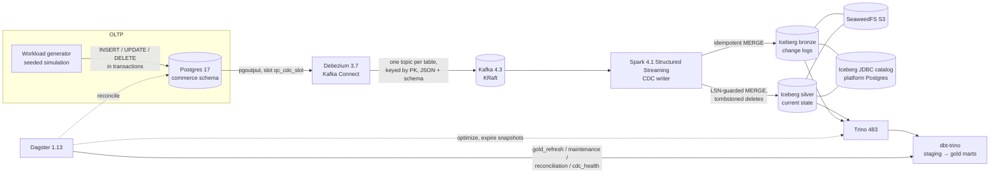

# quick-commerce-cdc-lakehouse

[](https://github.com/rohit91jacob/quick-commerce-cdc-lakehouse/actions/workflows/ci.yml)
[](https://github.com/rohit91jacob/quick-commerce-cdc-lakehouse/actions/workflows/refresh.yml)
[](https://rohit91jacob.github.io/quick-commerce-cdc-lakehouse/)
[](LICENSE)
[](pyproject.toml)

An end-to-end **change-data-capture lakehouse** for a 10-minute grocery delivery business (Blinkit / Zepto / Instacart style).

1. The OLTP side mixes **real public data** and a deterministic simulator. Real: the product catalogue (Open Food Facts products sold in India) and shelf prices observed in real shops (Open Prices), loaded incrementally. Simulated: dark stores, inventory, customers, orders, riders, payments and refunds.
2. Debezium streams every committed change from Postgres into Kafka.
3. A Spark Structured Streaming job lands the changes in Apache Iceberg as an append-only change log (bronze) and a current-state mirror (silver).
4. dbt on Trino builds analytics marts: funnel, delivery SLA, stock-outs and lost sales, baskets, cohorts, rider utilisation, promos.
5. Dagster orchestrates dbt, table maintenance, reconciliation and health checks.

**Live results, rebuilt every 4 hours:** https://rohit91jacob.github.io/quick-commerce-cdc-lakehouse/

The pipeline is **provably correct**: a reconciliation job compares every table and column aggregate between Postgres and silver, and must match exactly. The CI e2e job checks this after a writer crash, after a full replay, and after table maintenance.

## Architecture



| Component | Role | Code / config |
|---|---|---|
| Postgres (OLTP) | System of record; `wal_level=logical`, publication `qc_cdc_pub` | `src/qcommerce/db/migrations` |
| Workload generator | Discrete-event simulation of stores, customers, riders; real multi-table transactions, deletes and an online schema change | `src/qcommerce/generator` |
| Debezium | Initial snapshot + streaming, heartbeats, signalling table for incremental snapshots | `src/qcommerce/cdc/connector.py` |
| Kafka | One topic per table; hot tables have 3 partitions; 7-day retention | `docker-compose.yml` |
| CDC writer | `foreachBatch`: survey → parse → bronze MERGE → silver MERGE, schema evolution, dead letters, Prometheus metrics | `src/qcommerce/lakehouse` |
| Iceberg + SeaweedFS | Table format (v2, merge-on-read silver) on S3-compatible storage | `lakehouse/tables.py`, `infra/` |
| Trino | SQL engine for dbt, maintenance and reconciliation | `infra/trino` |
| dbt | 19 staging views, 2 intermediate, 15 gold models, 51 data tests, 1 unit test | `dbt/` |
| Dagster | Assets (silver as external assets with freshness checks, dbt models), jobs, schedules, failure sensor | `src/qcommerce/orchestration` |
| Reconciliation | Exact (two-phase fence) and settled modes | `src/qcommerce/reconcile.py` |

## Tech stack (pinned)

| | Version |
|---|---|
| PostgreSQL | 17.11 |
| Debezium Postgres connector / Connect image | 3.7.0.Final |
| Apache Kafka (KRaft) | 4.3.1 |
| Apache Spark / PySpark | 4.1.3 (Scala 2.13, Java 21) |
| Apache Iceberg (Spark runtime, AWS bundle) | 1.12.0 |
| Trino | 483 (Java 25) |
| SeaweedFS | 4.48 |
| dbt-core / dbt-trino | 1.10 / 1.10 |
| Dagster / dagster-dbt | 1.13.25 / 0.29.25 |
| Python | 3.12 (app image); the writer image uses the Spark image's Python |

Python dependencies are locked in `uv.lock`.

## Data

### Real vs simulated

| Data | Source | Real? | How it arrives |
|---|---|---|---|
| Product catalogue (name, brand, pack size, category, Nutri-Score, barcode) | [Open Food Facts](https://world.openfoodfacts.org): products sold in India (GS1 India barcodes, or observed at an Indian shop) | **Real**. 319 products in the committed snapshot; they fill about 56% of the store's 321 SKUs. Categories Open Food Facts doesn't cover (fresh produce, meat, household, personal and baby care) are simulated | `qc realdata catalogue-snapshot` (committed, refreshed on demand); seeded as `OFF-<barcode>` SKUs |
| Shelf prices | [Open Prices](https://prices.openfoodfacts.org): crowdsourced price tags and receipts from real shops worldwide (about 700 new observations a day) | **Real** | `qc realdata sync`, incremental by creation time, every 4 hours. New observations become real `INSERT`s in Postgres, so CDC carries real changes |
| Store selling prices | the latest **real INR** shelf price per barcode | **Real** where one exists (about 50% of SKUs), otherwise simulated | the same sync turns new INR prices into `UPDATE`s of `commerce.products` |
| Wholesale mandi prices (optional) | data.gov.in [Agmarknet](https://data.gov.in) daily prices | **Real**, off by default | set `QC_DATA_GOV_IN_API_KEY` (free key; see below) |
| Dark stores, customers, addresses, inventory, orders, riders, payments, refunds | seeded generator | **Simulated**: real quick-commerce orders are not public | `qc generator run`; each refresh simulates the time since the last order |

Indian coverage on Open Prices is thin (about 400 INR observations in total, a few a day), so the global price stream is kept as its own subject area (`market_*` tables, multi-currency marts) rather than being converted into rupees. Indian observations get a dedicated full-history stream, which is what prices the store.

Licences: Open Food Facts and Open Prices data are under the [Open Database License 1.0](https://opendatacommons.org/licenses/odbl/1-0/), (c) their contributors; Agmarknet data is under the Government Open Data License - India. The repo commits only the catalogue snapshot and two small Open Prices pages used by tests (`src/qcommerce/realdata/fixtures`), with attribution.

**Enabling Agmarknet.** Sign up at https://data.gov.in, copy the API key from *My Account*, and add it as the repository secret `QC_DATA_GOV_IN_API_KEY`, or export it locally. The refresh then upserts the day's mandi prices into `commerce.mandi_prices`. Without the key the step is skipped and logged.

### The simulation

- 2-5 cities, with dark stores that each have a catchment radius and picker capacity
- about 320 SKUs in 13 categories (real where possible, see above), with Pareto popularity
- customers with order propensities and churn, which yields cohort retention
- diurnal and weekly demand curves, festival spikes (Diwali, New Year's Eve...) and evening rain that raises demand and slows riders
- inventory depletion, restocks twice a day, stock-outs and delisting/relisting of SKUs
- substitutions at checkout and at picking, and lines removed when the shelf is empty
- UPI, card, wallet and COD payments with failures, and refunds for cancellations, missing items and late deliveries
- rider shifts with assignment queues, and a 10-minute promise (15 in rain)

The same seed, catalogue snapshot and start time always produce the same transaction stream (`tests/unit/test_generator_engine.py`).

**Refresh cadence.**
- The hosted pipeline (`refresh.yml`) runs every 4 hours. Each run resumes the stack, loads the new real observations, simulates the hours since the last order, reconciles, rebuilds dbt and republishes the site.
- Locally, the generator can run in wall-clock time (`--live-minutes -1`, `--rate-multiplier` scales demand), with `--backfill-hours` to simulate history first. The writer triggers every 10-15 s (each micro-batch then takes seconds to minutes; see limitations), and Dagster refreshes dbt gold every 15 minutes.

## Data model

| Layer | Where | Grain / key |
|---|---|---|
| OLTP | Postgres `commerce.*` (16 simulated-business tables + 4 real market-data tables) | primary keys; composite for `inventory (store_id, product_id)` and `mandi_prices` |
| Bronze | `lakehouse.bronze.<table>` | one row per change event, unique on (PK, `_lsn`, `_op`) |
| Silver | `lakehouse.silver.<table>` | one row per PK, current state, deletes as tombstones (`_is_deleted`) |
| Staging | `lakehouse.staging.stg_*` (views) | live silver rows; `*__changes` views over bronze |
| Gold | `lakehouse.gold.*` | dims (incl. SCD2 price and store history from the change log), facts (incremental), 8 store marts + 5 real-price marts (price changes, category price index, cross-shop dispersion, volatility, catalogue coverage) |

The full column-level description is in **[docs/data_dictionary.md](docs/data_dictionary.md)**. How duplicates, ordering, deletes and schema changes are handled is in **[docs/cdc_semantics.md](docs/cdc_semantics.md)**.

## Quickstart

### Prerequisites

- **Docker Compose path:** Docker with Compose v2, and about 8 GB RAM free for the stack.
- **Development path:** Python 3.12, [uv](https://docs.astral.sh/uv/), and Java 17+ for the Spark tests.

### Run with Docker Compose

> **Verified in CI only.** The development machine had no Docker, so these commands were not run locally. The `e2e` job in [`.github/workflows/ci.yml`](.github/workflows/ci.yml) runs the same flow through [`scripts/e2e.sh`](scripts/e2e.sh) on every push.

```bash
cp .env.example .env              # then change the secrets
make up                           # docker compose up -d --build --wait
make bootstrap                    # bucket, migration V001, seed reference data, register Debezium
make demo                         # continuous workload (24 h backfill, then live)
make reconcile                    # exact Postgres vs silver comparison
make dbt-build                    # dbt build on Trino
open http://localhost:3000        # Dagster UI (schedules start automatically)
```

Useful endpoints:

| URL | What |
|---|---|
| `localhost:3000` | Dagster |
| `localhost:8080` | Trino (catalog `lakehouse`) |
| `localhost:8083` | Kafka Connect REST |
| `localhost:9405/metrics` | writer metrics (`/progress` for JSON) |

### Run bare-metal (how this repo was developed)

The services run as plain processes (Postgres from conda-forge, the Kafka/Trino/SeaweedFS tarballs, the Debezium plugin). The `qc` CLI reaches them through the `QC_*` variables. These commands were run exactly like this:

```bash
uv sync --extra app --python 3.12                       # creates the virtualenv
python -m qcommerce.cli db migrate --target 1           # V001 only; V002 is applied mid-run by the generator
python -m qcommerce.cli generator seed
python -m qcommerce.cli cdc register                    # connector RUNNING, initial snapshot
python -m qcommerce.cli writer run                      # long-running (Spark jars resolved via QC_WRITER_JARS_PACKAGES)
python -m qcommerce.cli generator run --backfill-hours 6 --live-minutes 4 --schema-change-after-minutes 1.5
python -m qcommerce.cli reconcile --mode exact --timeout 1800
```

Output of the last two commands, from that run:

```text
{"msg": "backfill finished", "orders": 851, "txns": 5748}
{"msg": "applied migration", "version": 2, "migration": "orders_tip_amount"}
{"msg": "generator finished", "orders_placed": 865, "orders_delivered": 807, "sla_met": 597, "sla_breached": 210,
 "items_removed_at_picking": 24, "substitutions_at_checkout": 174, "transactions": 5825, "operations": 24817, ...}

reconciliation (exact) PASSED in 115.0s, fence LSN 0/23BA918
table                   source rows  silver rows  result
cities                            2            2  ok
dark_stores                       6            6  ok
...
orders                          865          865  ok
order_items                   3,223        3,223  ok
order_status_history          5,028        5,028  ok
payments                        865          865  ok
refunds                          43           43  ok
```

Other commands run during development:

```bash
python -m qcommerce.cli ops checksums --schema silver                    # content fingerprints per table
python -m qcommerce.cli cdc status                                       # connector + replication slot lag
cd dbt && dbt build && dbt source freshness                              # PASS=88 WARN=0 ERROR=0
dagster job execute -m qcommerce.orchestration.definitions -j iceberg_maintenance   # also: reconciliation, cdc_health, gold_refresh
```

## Configuration

Every component reads `QC_*` environment variables (`src/qcommerce/settings.py`). Compose takes its secrets from `.env` (see [`.env.example`](.env.example)).

| Variable | Default | Purpose |
|---|---|---|
| `QC_PG_ADMIN_PASSWORD` / `QC_PG_APP_PASSWORD` / `QC_PG_DEBEZIUM_PASSWORD` | — | OLTP roles: owner (migrations), `qc_app` (generator, reconciliation), `debezium` (replication) |
| `ICEBERG_DB_PASSWORD`, `DAGSTER_DB_PASSWORD` | — | platform Postgres roles (Iceberg catalog, Dagster storage) |
| `S3_ACCESS_KEY`, `S3_SECRET_KEY` | — | SeaweedFS S3 identity used by Spark and Trino |
| `QC_GEN_SEED` | `42` | generator seed (also `QC_GEN_CITIES`, `_STORES_PER_CITY`, `_PRODUCTS`, `_CUSTOMERS`, `_RIDERS_PER_STORE`, `_BASE_ORDERS_PER_STORE_HOUR`, `_PROMISED_MINUTES`) |
| `QC_DEMO_BACKFILL_HOURS` | `24` | history simulated by `make demo` before going live |
| `QC_WRITER_TRIGGER_SECONDS` | `15` (compose: `10`) | micro-batch interval |
| `QC_WRITER_MAX_OFFSETS_PER_TRIGGER` | `100000` | batch size cap (bigger batches amortise per-table MERGE cost) |
| `QC_WRITER_MERGE_RETRIES` | `5` | retries on Iceberg commit conflicts (e.g. with compaction) |
| `QC_WRITER_CHECKPOINT_LOCATION` | `/data/checkpoints/cdc-writer` (image) | Spark checkpoint; deleting it triggers a full, idempotent replay |
| `QC_*_HOST_PORT` | 5432 / 8083 / 8080 / 9405 / 3000 | host ports published by compose |
| `QC_ALERT_WEBHOOK_URL` | unset | Dagster run-failure alerts are POSTed here |
| `QC_LOG_LEVEL`, `DBT_TARGET` | `INFO`, `dev` | logging (JSON lines) and the dbt target (`ci` in the e2e test) |
| `QC_GEN_REAL_CATALOGUE` | `true` | seed real Open Food Facts products where the snapshot has them |
| `QC_DATA_GOV_IN_API_KEY` | unset | enables Agmarknet mandi prices (optional) |
| `QC_CATCH_UP_HOURS` | `6` | most hours a refresh simulates since the last order (`scripts/refresh.sh`) |

## Testing & CI

| Suite | Command | What it covers |
|---|---|---|
| Unit | `python -m pytest tests/unit` | generator invariants (replayed into an in-memory relational model: keys, stock ≥ 0, state machine, money adds up, determinism, deletes present), Connect-schema → Spark type mapping, MERGE SQL, reconciliation comparisons, metrics, CLI |
| Spark | `python -m pytest tests/spark` | the real `foreachBatch` against a local Iceberg catalog: snapshot + streaming, duplicates and full replay, stale and out-of-order events, delete-before-insert, re-insert after delete (composite key), schema evolution, mixed schema versions in one batch, TOAST placeholders, TRUNCATE, dead letters |
| Integration | `python -m pytest -m integration tests/integration` | migrations (stepwise, idempotent), seed, backfill and resume against Postgres; `realdata sync` on real fixture pages (incremental cursor, idempotent re-run, catalogue repriced to the latest real INR price) |
| dbt | `dbt build` | 51 data tests (generic and custom: `non_negative`, `between`, `scd2_valid_intervals`; singular: totals add up, lines match subtotal, lifecycle order) plus a unit test of the SCD2 model |

Locally all of these pass: 44 unit + 3 integration tests, 12 Spark tests, `dbt parse` and Dagster definitions validation. Live `qc realdata sync` results against the real APIs are in the [runbook](docs/runbook.md#scheduled-refresh-github-actions).

CI ([`.github/workflows/ci.yml`](.github/workflows/ci.yml)) has four jobs:

| Job | What it does |
|---|---|
| `lint` | ruff lint and format check, `dbt parse`, Dagster definitions validation |
| `unit` | unit + Spark tests on Java 21 |
| `integration` | Postgres service container |
| `e2e` | builds both images, then runs `scripts/e2e.sh` on the full Compose stack: workload with schema change → SIGKILL + restart of the writer → exact reconciliation → full replay with unchanged checksums → dbt build, freshness and docs → Dagster maintenance, reconciliation and health jobs → exact reconciliation again. Reports are uploaded as artifacts |

Two more workflows run on a schedule:

| Workflow | Schedule | What it does |
|---|---|---|
| [`refresh.yml`](.github/workflows/refresh.yml) | every 4 hours (`:17`), or **Run workflow** (optionally `fresh`) | Builds the images (layer cache) and restores the stack's Docker volumes from the Actions cache. Then runs `scripts/refresh.sh`: real-data sync, simulated catch-up, exact reconciliation, `dbt build` + freshness, Iceberg maintenance, results site, clean shutdown. Finally it archives the volumes back into the cache (superseded caches pruned) and deploys the site to GitHub Pages. A failed scheduled run opens, or comments on, a "Scheduled refresh is failing" issue |
| [`keepalive.yml`](.github/workflows/keepalive.yml) | 1st and 15th of each month | Re-enables the scheduled workflows through the API, so GitHub's 60-day inactivity rule never disables them, with no dummy commits |

No credentials are needed for any of this: both APIs are public, and the workflows use only the built-in `GITHUB_TOKEN`. The optional Agmarknet key is the only secret.

Dependabot keeps uv, Docker and Actions dependencies current, and `.pre-commit-config.yaml` mirrors the lint job.

## Operations

| Job | Schedule (IST) | Purpose |
|---|---|---|
| `gold_refresh` | every 15 min | `dbt build` (incremental facts with a 6 h lookback) |
| `cdc_health` | every 5 min | connector and task state, slot lag, writer offsets behind, dead letters |
| `reconciliation` | hourly at :45 | settled-mode comparison of Postgres and silver |
| `iceberg_maintenance` | daily at 03:30 | `optimize`, `expire_snapshots`, `remove_orphan_files` on bronze and silver |

Silver freshness is an asset check (warn after 15 min, error after 60 min), dbt source freshness runs as well, and failed runs trigger the alert sensor.

**Backfill / reprocessing.** Deleting the writer checkpoint replays every topic idempotently. This was verified locally: 33,197 records replayed, and silver (19,032 rows) and bronze (32,710 rows) checksums came out identical, with reconciliation still exact. A writer SIGKILL during live traffic also needs no clean-up. For data older than Kafka retention, use a Debezium incremental snapshot (`qc cdc snapshot --tables ...`).

See the **[runbook](docs/runbook.md)** for slot problems, re-snapshots, schema changes, failed MERGEs and dead letters.

## Project structure

```text
├── src/qcommerce/
│   ├── db/migrations/        V001 schema + publication, V002 online schema change, V003 real market data
│   ├── realdata/             Open Food Facts catalogue snapshot, Open Prices + Agmarknet clients, `sync`
│   ├── generator/            reference data, demand curves, event-driven engine, Postgres sink, runner
│   ├── cdc/connector.py      Debezium config, registration, incremental snapshots, slot lag
│   ├── lakehouse/            Connect-schema decoding, batch survey/parse, Iceberg DDL + MERGEs, writer, metrics
│   ├── orchestration/        Dagster definitions
│   ├── reconcile.py          exact / settled reconciliation with fences
│   ├── maintenance.py        Iceberg maintenance via Trino
│   ├── ops.py, checksums.py  health checks, table fingerprints
│   ├── site.py               static results site (GitHub Pages)
│   └── cli.py                `qc` command
├── dbt/                      staging → intermediate → gold (core + analytics), tests, macros
├── docker/                   multi-target Dockerfile (app, writer), jar fetcher with checksum verification
├── infra/                    Trino, platform DB, Dagster and SeaweedFS config
├── docker-compose.yml        full stack
├── scripts/e2e.sh            end-to-end test (CI)
├── scripts/refresh.sh        scheduled refresh (GitHub Actions)
├── tests/                    unit, spark, integration
└── docs/                     CDC semantics, data dictionary, runbook, ADRs
```

## Design rationale

Four constraints shaped the design. Every hop delivers at least once, yet silver has to equal Postgres exactly, and provably. All components are open source, and the whole stack runs from one Compose file sized for a 16 GB machine or a GitHub-hosted runner. The hosted refresh runs every 4 hours on ephemeral runners, with no cloud account and no credentials beyond the built-in `GITHUB_TOKEN` (the Agmarknet key is optional). And data is real wherever a public source exists; the rest is simulated, deterministically, and labelled as such. The [ADRs](docs/adr/) record the context of the main decisions and are linked below where they apply.

### Architecture decisions

| Decision | Why | Alternatives considered | Trade-off accepted |
|---|---|---|---|
| **Log-based CDC**: Debezium streams the WAL through slot `qc_cdc_slot` (`pgoutput`) for an explicit publication, `qc_cdc_pub` | Debezium sees every committed change in commit order, deletes and intermediate versions included, each with its LSN. The workload deletes on purpose (lines removed at picking, expired promos, removed addresses, delisted SKUs), and the SCD2 dims need every version. An explicit table list needs table ownership, not superuser | Polling `updated_at` (misses deletes and the versions between polls); triggers or an outbox table written by the application | A slot to operate: it holds WAL while the connector is down, up to `max_slot_wal_keep_size=2GB`, after which it is lost and needs a re-snapshot ([runbook](docs/runbook.md#replication-slot-problems)). A column added with a default emits nothing for existing rows, so V003 touches every product |
| **Bronze, then silver, in every micro-batch**, tables committed parents first (`tables.LOAD_ORDER`) | Bronze (unique on PK, `_lsn`, `_op`) keeps the full history for the SCD2 dims and `*__changes` views; silver gives staging the current state without re-deduplicating the log. Bronze first keeps the change log a superset of silver; parents first mean an order item is never visible without its order | Current state only (history lost); the change log only, collapsed to current state by dbt on every run | A bronze and a silver commit per touched table per batch (cost under Known limitations). Commits are atomic per table, not per batch: a reader can briefly see a parent row before its children (never the reverse); the reconciliation fence gives an exact cut |
| **Idempotent, order-independent MERGEs**: bronze inserts only unseen (PK, LSN, op); silver applies a change only if its LSN is newer and keeps deletes as tombstones ([ADR 0005](docs/adr/0005-tombstones-and-lsn-guard.md)) | Debezium can resend after a crash and Spark re-runs a failed batch, so duplicates and replays are normal. Any interleaving of duplicates, stale and out-of-order events converges to the source state ([CDC semantics](docs/cdc_semantics.md)), so a writer SIGKILL needs no clean-up and deleting the checkpoint is a supported full replay | A plain upsert with hard deletes (a late insert resurrects a deleted row); hard deletes plus delete LSNs kept in a side table | Readers must filter `NOT _is_deleted` (staging does). Tombstones take space until the opt-in purge, whose horizon must exceed Kafka retention |
| **Self-describing events, online schema evolution**: Debezium JSON embeds the Connect schema, and the writer adds columns and applies Iceberg-legal widenings itself ([ADR 0002](docs/adr/0002-json-with-embedded-schemas.md)) | A new column is usable from its first event, with no registry to run; NUMERIC precision is propagated, so decimals land as exact `decimal(p,s)`. V002 and V003 are applied while CDC runs (`scripts/e2e.sh`), and the `optional_column` macro lets staging reference a column before it exists | Avro with a schema registry (Apicurio or Confluent), the upgrade at higher volume; manual lake DDL before each migration | Messages embed their schema (8–15 KB each before compression): zstd removes most of that on the wire, but Spark still parses it. An incompatible change stops the batch rather than write anything wrong |
| **Correctness is measured**: exact reconciliation behind a two-phase fence, and dbt tests at `severity: error` | Exact mode pauses the generator, waits until the slot confirms fence 1 and silver shows fence 2, then compares row counts and per-column aggregates (`src/qcommerce/reconcile.py`). CI runs it after a writer SIGKILL, a full replay and maintenance. In the hosted refresh a mismatch or a failing test fails the run, so neither the state archive nor the site is updated | Row counts only (blind to wrong values); checks on the lake alone, which cannot see drift from the source | Exact mode holds the workload paused while it runs (the bare-metal reconciliation above took 115 s). The hourly settled mode needs no pause, but assumes `updated_at` tracks commit time: true for OLTP traffic, not during a synthetic backfill (use exact mode then) |
| **Gold built from the change log**: SCD2 history dims read bronze in LSN order; `fct_orders` and `fct_order_items` are incremental (`delete+insert` per order, 6 h lookback); marts are rebuilt as tables | The change log holds every price and store version in commit order, so late or duplicated delivery cannot reorder versions (`dim_product_price_history.sql`, pinned by a dbt unit test). `fct_orders` rebuilds every order whose row, lines, payment or refunds changed in the window, which picks up late refunds and picking changes | dbt snapshots of silver (they only see the state at each run); rebuilding the facts in full every 15 minutes | Each run re-processes every order touched in the last 6 h and rebuilds every mart in full, which suits this volume; at scale the marts would need to be incremental too |
| **Real public data next to the simulation, never blended**: Open Food Facts products and Open Prices observations land in the OLTP as real rows; global prices stay a multi-currency subject area (`market_*`) ([ADR 0007](docs/adr/0007-real-public-data.md)) | Real quick-commerce orders are not public, but what is sold and what it costs are. New observations become real `INSERT`s and repricings real `UPDATE`s, so CDC carries real changes. Converting prices into rupees, or attaching them to the fictional stores, would fabricate data; the site labels every section REAL or SIMULATED | A fully synthetic OLTP; converting global prices to INR to price every SKU | The store is only partly real (about 56% of SKUs are real products, about 50% carry a real INR price). CI stays deterministic on two committed pages of real observations and never calls the live APIs; the hosted refresh does |
| **Whole-stack state as Docker volume archives**: each hosted refresh restores every volume from the Actions cache, runs, stops cleanly and archives them again ([ADR 0008](docs/adr/0008-refresh-state-persistence.md)) | The slot position, Kafka offsets, Spark checkpoints, Iceberg data and catalog have to stay consistent with each other on ephemeral runners. Restores are exact, with no re-snapshot, and state is archived only after a successful run, so a failure leaves the last good state in place | `pg_dump` plus Iceberg exports (no slot position to match the Kafka offsets, so a re-snapshot or lost changes); an always-on VM or cloud account | The Actions cache is best-effort storage. If it is evicted, the next run starts fresh: the real price history is re-fetched (14 days globally, all of it for India), but the simulated order history restarts |

### Stack choices

| Layer | Choice (pinned) | Why this | Why not the alternatives |
|---|---|---|---|
| OLTP source | PostgreSQL 17.11 | Built-in logical decoding (`pgoutput`) and replication slots with a WAL cap; money as `numeric(10,2)`, reconciled to the paisa; least-privilege roles (owner for migrations, `qc_app` for DML, `debezium` with `REPLICATION`). The same image runs the platform database | MySQL's binlog works with Debezium too, but would add a second database engine next to the platform Postgres. Cloud: a managed Postgres with logical replication (Amazon RDS or Aurora) |
| Change capture | Debezium 3.7.0.Final, Postgres connector on Kafka Connect | Initial and incremental snapshots (signalling table), heartbeats that keep the slot advancing while tables are quiet, and LSN, `txId` and commit time on every event (`src/qcommerce/cdc/connector.py`) | A hand-written `pgoutput` consumer would re-implement snapshots, offsets and heartbeats; scheduled ELT syncs (Airbyte, Fivetran) land batches, not a replayable change stream. Cloud: the same connector on Amazon MSK Connect |
| Event log | Apache Kafka 4.3.1, KRaft, one broker | Kafka Connect is Debezium's native runtime; messages are keyed by primary key, so each row's changes stay in order (hot tables get 3 partitions); 7-day retention is the replay window; KRaft runs broker and controller in one process | Redpanda speaks the Kafka API, but with KRaft already a single process it would change little here. Cloud: Amazon MSK or Confluent Cloud |
| Stream writer | Apache Spark / PySpark 4.1.3 Structured Streaming (Scala 2.13, Java 21) | Kafka source with checkpointed offsets, `foreachBatch` for per-batch SQL, and Iceberg `MERGE INTO`. The writer has no Python UDFs, so parsing and MERGEs run in the JVM, and `tests/spark` runs the same code against a local Iceberg catalog ([ADR 0001](docs/adr/0001-spark-structured-streaming-writer.md)) | The Iceberg Kafka Connect sink appends or upserts but cannot express "apply only if newer"; Flink adds a cluster and a state backend to operate. Cloud: Amazon EMR or Spark on Kubernetes |
| Table format | Apache Iceberg 1.12.0, format v2, zstd Parquet | `MERGE`, `UPDATE` and `DELETE` from both Spark and Trino; schema evolution in metadata only; hidden partitioning (`bucket(8, order_id)` in silver, `days(_ingested_at)` in bronze); merge-on-read silver writes delete files instead of rewriting data files every batch, and `iceberg_maintenance` compacts them | Delta Lake would need a metastore (Hive or Glue) shared by Spark and Trino; Trino's Hudi connector is read-only, and dbt writes gold through Trino. Cloud: unchanged, Iceberg on S3 |
| Catalog | Iceberg `JdbcCatalog` (schema V1) in a separate platform PostgreSQL 17.11 | Native in both engines and no extra service (the same database holds Dagster's storage); a commit is an atomic compare-and-swap on the pointer row; kept apart from the OLTP, so catalog writes never show up in the source WAL or slot lag ([ADR 0003](docs/adr/0003-iceberg-jdbc-catalog.md)) | A Hive metastore is one more JVM service; a Hadoop catalog (used only by `tests/spark`) relies on atomic renames that object stores lack; a REST catalog is the upgrade path (Roadmap). Cloud: AWS Glue Data Catalog or a managed REST catalog |
| Object storage | SeaweedFS 4.48, one `weed server -s3` process | S3 API, Apache-2.0, actively released; exercises the same Iceberg `S3FileIO` and Trino native-S3 code paths as Amazon S3 ([ADR 0004](docs/adr/0004-seaweedfs-object-storage.md)) | MinIO's community server is archived, with no security updates; a local filesystem would skip the S3 code path. Cloud: Amazon S3 or another object store, with the same settings |
| SQL engine | Trino 483 | Shares the JDBC catalog with Spark, writes Iceberg (dbt models, tombstone purges) and runs `optimize`, `expire_snapshots` and `remove_orphan_files`; one coordinator serves dbt, maintenance, reconciliation and the results site | dbt-spark would need a Thrift server, or a Spark session per run, next to the streaming driver. Cloud: Amazon Athena (Trino-based) or a managed Trino such as Starburst Galaxy |
| Transformations | dbt-core 1.10.23, dbt-trino 1.10.6 | Tested SQL models (generic, custom and singular tests plus a unit test), docs, and a manifest that `dagster-dbt` turns into assets; macros carry the CDC specifics (`dedupe_changes`, `optional_column`) and IST reporting (`local_time.sql`) | SQLMesh would also work, but `dagster-dbt` maps dbt's manifest straight to assets and checks; plain SQL run from Dagster ops would lose tests, docs and lineage. Cloud: dbt-athena, or dbt-trino on a managed Trino |
| Orchestration | Dagster 1.13.25, dagster-dbt 0.29.25, storage in the platform Postgres | Asset model: silver tables are external assets with freshness checks, dbt models are assets whose tests become asset checks; jobs for maintenance, reconciliation and CDC health; a run-failure sensor posts alerts ([ADR 0006](docs/adr/0006-dagster-orchestration.md)) | Airflow (with Cosmos for dbt) would work, but is organised around task DAGs rather than assets; cron would lose run history, lineage and the failure sensor. Cloud: Dagster+ or the same containers on ECS or Kubernetes |
| Language and tooling | Python 3.12 in the app image (the writer uses the Spark image's Python); uv 0.11.16 with `uv.lock`; pydantic-settings 2.15.0; ruff 0.16.10 | One package and `qc` CLI for generator, CDC tooling, writer, reconciliation and orchestration; `uv sync --frozen` gives CI and the app image the same locked environment; pydantic-settings reads the same `QC_*` variables in Compose, CI and bare metal | Poetry or pip-tools also lock, but uv is one fast binary for CI, the app image and local setup; a Scala writer would add a second language while its work already runs in the JVM |
| Runtime and automation | Docker Compose; GitHub Actions and Pages | Two images from one `docker/Dockerfile` (`app` on `python:3.12-slim-bookworm`, `writer` on the `apache/spark` image with SHA-1-verified jars) run the same stack in CI (`scripts/e2e.sh`) and in the hosted refresh (`scripts/refresh.sh`); the results site is static HTML on Pages, so nothing has to keep running | Kubernetes (kind, minikube) would add a cluster to a single-runner job; an always-on VM or cloud account costs money and needs credentials; a dashboard server (Superset, Streamlit) needs hosting. Cloud: the same images on ECS or Kubernetes, the site on S3 and CloudFront |

### What would change in production

- **Persistent, replicated services.** Kafka, Connect, Trino and SeaweedFS run as single nodes with replication factor 1: a topology for development and CI, not high availability. A real deployment would use persistent infrastructure (managed Postgres, a replicated Kafka cluster, Amazon S3 or another object store), and the volume archives of ADR 0008 would not be needed.
- **Durable writer state, more compute.** Spark checkpoints sit on a container volume; in production they belong on durable shared storage. The writer is one local-mode driver (`local[2]` in Compose); production would give it more cores or a cluster.
- **Reconciliation against a live source.** Exact mode pauses the workload through `ops.generator_control`, which only the simulator honours. Against a real OLTP, the hourly settled mode, which needs no pause, would be the standing check.
- **Secrets and retention.** Passwords and the single S3 key come from `.env`; production would take them from a secret store, or replace static keys with workload identities. Trino accepts retention as short as 1 h for the demo and CI (`infra/trino/catalog/lakehouse.properties`); production keeps the 7-day minimum.

**Known limitations**

- Micro-batch cost is roughly 8–15 s per table touched: each table means a few Spark jobs and two Iceberg commits. A batch touching every table takes about 2–5 minutes in local mode, so freshness is minutes. Larger batches, more cores or fewer per-table commits are the levers.
- Real data is crowdsourced. Coverage, especially for India, depends on contributors, and Open Prices' API exposes no update feed, so edits to old observations aren't picked up.
- Orders are simulated. The real-price share in `mart_basket_daily` uses each product's provenance as of today, not at order time.

**Roadmap**

- Iceberg REST catalog (Polaris or Lakekeeper) with credential vending
- Avro with a schema registry
- Grafana dashboards over the writer's Prometheus metrics and Debezium JMX
- Flink or the Iceberg Kafka Connect sink for lower latency on append-only tables
- Partition evolution for bronze at scale

## License

[MIT](LICENSE). All data is synthetic.
